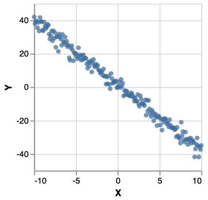
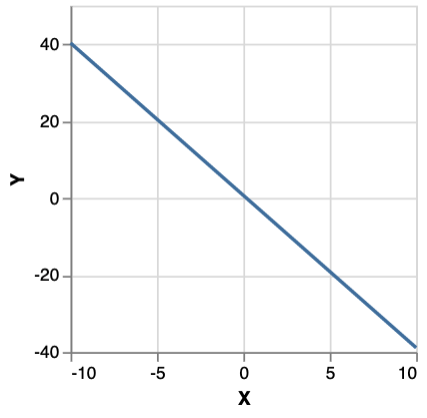

# User Guide


Probabilistic programming is all about being able to write probabilistic models as programs. For instance, here is a Bayesian linear regression model:

```haskell
paramPriorRegression :: MonadSample m => m (Double, Double, Double)
paramPriorRegression = do
    slope <- normal 0 2
    intercept <- normal 0 2
    noise <- gamma 4 4
    return (slope, intercept, noise)

regression :: (MonadInfer m) => [Double] -> [Double] -> m (Double, Double, Double)
regression xs ys = do
    params@(slope, intercept, noise) <- paramPriorRegression
    forM (zip xs ys) \(x, y) -> factor $ normalPdf (slope * x + intercept) (sqrt noise) y
    return (slope, intercept, noise)
```

`regression` takes observations of `xs` and `ys`, and using the prior expressed by `paramPriorRegression`, returns the posterior conditioned on the observations.

This is the *model*. To perform *inference* , suppose we have a data set of `xs` and `ys` like:



We could then run the model as follows:

```haskell   
mhRunsRegression = sampleIO $ prior $ mh 1000 $ regression xs ys
```

This yields 1000 samples from an MCMC walk using an MH kernel. Plotting one gives:



Monad-bayes provides a variety of MCMC and SMC methods, and methods arising from the composition of the two. 


<!-- `sprinkler` is a distribution over values for the Boolean `rain` variable given the likelihood and observation specified above. `enumerate` is a function which performs **inference**: it takes the abstract distribution `sprinkler` and calculates something concrete - in this case, the probability mass function.

`sprinkler` is specified as a program that has randomness (e.g. `bernoulli`) and scoring (e.g. `condition`). Hence the term *probabilistic programming*. The Grand Vision is that you write your statistical model as a probabilistic program and then choose or construct a method to perform inference in a statistically and computationally efficient way. -->

## monad-bayes vs other libraries


monad-bayes is a universal probabilistic programming language, in the sense that you can express any computable distribution. In this respect it differs from Stan, which focuses instead on handling inference on an important subset well.

There is a variety of universal probabilistic programming libraries and/or languages, which include WebPPL, Gen, Pyro and Edward.

**What other approaches have that monad-bayes lacks**:

A lot of engineering work has been put into the above libraries and languages to make them practical for real-world problems. While monad-bayes' core is very nice, it doesn't come with a lot of the batteries you might want. (The author's PhD thesis contains this relevant paragraph: "our library implements basic versions of advanced sampling algorithms. However, their successful application in practice requires incorporating established heuristics, such as: adaptive proposal distributions, controlling resampling with effective sample size, tuning rejuvenation kernels based on population in SMC2, and so on.")

**What monad-bayes has that is unique**: 

Models are monadic and inference is modular. Complex inference algorithms like RMSMC or PMMH are built out of simple composable pieces, and so are expressable extraordinarily simply.

Probabilistic programs in monad-bayes are first class programs in Haskell. This allows all of Haskell's expressive power to be brought to bear. You can write distributions over any datatype (lists, trees, functions, smart contracts, etc). You can use powerful libraries like Pipes, lens and Parsec. Everything is pure. You can make use of laziness. Everything is strongly typed. There's no new special syntax or keywords.

## References

Other probabilistic programming languages with fairly similar APIs include WebPPL and Gen. This cognitive-science oriented introduction to WebPPL is an excellent resource for learning about probabilistic programming: https://probmods.org/. The tutorials for Gen are also very good, particularly for learning about traces: https://github.com/probcomp/gen-quickstart/blob/master/tutorials/A%20Bottom-Up%20Introduction%20to%20Gen.ipynb.

## Specifying distributions

A distribution in monad-bayes over a set $X$, is of type:

```haskell
MonadInfer m => m X
```

monad-bayes provides standard distributions, such as:

- `random :: MonadInfer m => m Double` : sample uniformly from $[0,1]$

The full set is listed at https://hackage.haskell.org/package/monad-bayes-0.1.1.0/docs/Control-Monad-Bayes-Class.html

Note that these primitives already allows us to construct quite exotic distributions, like the uniform distribution over `(+) :: Int -> Int -> Int` and `(-) :: Int -> Int -> Int`:

```haskell
distributionOverFunctions = uniformD [(+), (-)]
```

### Constructing distributions as programs

monad-bayes also lets us construct new distributions out of these. `MonadInfer m` implies `Monad m` and in turn `Functor m`, so we can do the following:

```haskell
fmap (> 0.5) random :: MonadInfer m => m Bool
```

This is the uniform distribution over $(0.5, 1]$.

As an important special case, if `x :: MonadInfer m => m (a,b)` is a joint distribution over two variables, then `fmap fst a :: MonadInfer m => m a` **marginalizes** out the second variable. That is to say, `fmap fst a` is the distribution $p(a)$, where $p(a) = \int_b p(a,b)$

The above example use only the functor instance for `m`, but we also have the monad instance, as used in:

```haskell
example :: MonadInfer m => m Double
example = bernoulli 0.5 >>= (\x -> if x then random else normal 0 1)
```

It's easiest to understand this distribution as a probabilistic program: it's the distribution you get by first sampling from `bernoulli 0.5`, then checking the result. If the result is `True`, then sample from `random`, else from `normal 0 1`. As a distribution, this has a PDF:

$$ f(x) = 1[0\leq x \leq 1]*0.5  + \mathcal{N}(0,1)(x)*0.5  $$
<!-- $$ \int\_{[0,1]} 1[x>0.5]* + (1[x\leq 0.5]*N(0,1)(x)) dx $$ -->

Equivalently, we could write this in do-notation as:

```haskell
example :: MonadInfer m => m Double
example = do
  bool <- bernoulli 0.5
  if bool then random else normal 0 1
```

**A technical note**: it is often tempting to read the line `bool <- bernoulli 0.5` as saying "take a sample from `bernoulli 0.5`. But although we'll see below that `example` can be interpreted as a sampler, there are many other interpretations, not least as a mathematical specification of a particular distribution.

That said, it is often useful to think of probabilistic programs as specifying distributions over **program executation traces**. For example, one trace of `example` as defined above is (informally): `{bernoulli 0.5 : True, random : 0.7}`.

### Hard and soft conditioning

monad-bayes provides a function `score :: MonadInfer m => Log Double -> m ()`. (**Note**: `Log Double` is a wrapper for `Double` which stores doubles as their logarithm, and does multiplication by addition of logarithms.)

```haskell
example :: MonadInfer m => m Double
example = do
  bool <- bernoulli 0.5
  number <- if bool then random else normal 0 1
  score number 
  return bool
```

It's easiest to understand this in terms of the "program execution trace" perspective described above. What the score statement does is to multiple every trace by the value of `number` in that particular trace.

`condition` in then defined as follows:

```haskell
condition :: MonadInfer m => Bool -> m ()
condition b = score $ if b then 1 else 0
```
So `condition b` throws away every trace in which `b` is False, and keeps all traces in which `b` is True. For example:

```haskell
example :: MonadInfer m => m Int
example = do
  n <- poisson 0.5
  condition (n%2 == 0)
  return n
```

This describes a poisson distribution in which all even values of the random variable are marginalized out.

<!-- Another use case is Bayesian inference as in:

<!-- The most intuitive way to understand `score` is to think of a probabilistic program as making a series of random choices which trace out a possible execution of the program. At any point in this series, we can interject a `score x` statement, where the value of `x` depends on the previous choices. This statement multiplies the weight of this "trace" by the score. -->

<!-- ```haskell
bayesianExample :: (Eq a, MonadInfer m) => m a -> (a -> m b) -> (b -> m a)
bayesianExample prior likelihood b = do
    a <- prior
    b' <- likelihood a
    condition (b==b')
    return a
```

Note that operationally speaking, this approach is only going to work well for discrete distributions, since `b==b'` is going to be zero-measure in the continuous case. But in the discrete case, we could for example do: -->

<!-- ```haskell
example :: MonadInfer 
example =  bayesianExample (bernoulli 0.5) (\x -> if x then bernoulli 0.8 else bernoulli 0.9) True 
``` 
-->


<!-- ```haskell
example :: MonadInfer m => m Bool
example = do 
  x <- normal 0 1
  y <- normal 0 2
  z <- normal 0 3
  return (x > y)
```

Note that in this example, commenting out the line `z <- normal 0 3` would not change the distribution at all. **But**, there is no guarantee in theory that the inference method you use knows this. More generally,  -->

<!-- **Not all ways of expressing denotationally equivalent distributions are equally useful in practice** -->

## Performing inference

To quote [this page](https://webppl.readthedocs.io/en/master/inference/), "marginal inference (or just inference) is the process of reifying the distribution on return values implicitly represented by a stochastic computation.". That is, a probabilistic program (stochastic computation) is an abstract object and inference transforms it into something concrete, like a histogram, a list of samples, or parameters of a known distribution.

All inference methods in monad-bayes work with all distributions. The only exception is that exact inference only works with discrete distributions and will throw a runtime error on continuous distributions.

**The challenge of inference** is that most distributions that are of interest are not as simple as `sprinkler`. They could have continuous random variables, a huge number of them, or even a number of them that is itself random. They could involve a series of observations, interspersed with other sources of randomness.

Designing a language in which you can specify arbitrarily complex (computable) distributions as probabilistic programs turns out to be a largely solved problem. The tools given about are sufficient for that. 

The hard part is designing a language where you can specify how you want to do inference, because sophisticated, often approximate, inference methods are almost always necessary for the models involved in solving real world problems.

Two of the large classes of inference methods are **sampling based methods** and **gradient based methods**. The latter only apply to continuous probability distributions, and are not the focus of monad-bayes.

<!-- For the purposes of this section, let `dist :: MonadInfer m => m a` be the distribution you want to perform inference on.  -->

### Exact inference

```haskell
enumerate :: Ord a => Enumerator a -> [(a, Double)]
```

So `enumerate (bernoulli 0.7)` gives you

```
[(False,0.3),(True,0.7)]
```

**Note: enumerate only works on finite discrete distributions**

It will run forever on infinite distributions like `enumerate (poisson 0.7)` and will throw the following **runtime** error on continuous distributions as in `enumerate (normal 0 1)`:

*"Exception: Infinitely supported random variables not supported in Enumerator"*

**However**, it's totally fine to have the elements of the support to be infinite but discrete, as in:

```haskell
fmap (\(ls,p) -> (take 4 ls, p)) $ enumerate $ uniformD [[1..], [2..]]
```

which gives

```
[([1,2,3,4],0.5),([2,3,4,5],0.5)]
```

### Independent forward sampling

For any probabilistic program `p` without any `condition` or `factor` statements, we may do `sampleIO p` or `sampleSTfixed p` (to run with a fixed seed) to obtain a sample in an ancestral fashion. For example, consider:

```haskell
example = do
  x <- bernoulli 0.5
  if x then normal 0 1 else normal 1 2
```

`sampleIO example` will produce a sample from a Bernoulli distribution with $p=0.5$, and if it is $True$, return a sample from a standard normal, else from a normal with mean 1 and std 2. '

`(replicateM n . sampleIO) example` will produce a list of `n` independent samples. However, it is recommended to instead do `(sampleIO . replicateM n) example`, which will create a new model (`replicateM n example`) consisting of `n` independent draws from `example`. 

Because `sampleIO example` is totally pure, it is parallelizable. 

### Independent weighted sampling

To perform weighted sampling, use:

```haskell
(sampleIO . runWeighted) :: Weighted SamplerIO a -> IO (a, Log Double)
```

`Weighted SamplerIO` is an instance of `MonadInfer`, so we can apply this to any distribution. For example, suppose we have the distribution:

```haskell
example :: MonadInfer m => m Bool
example = do
  x <- bernoulli 0.5
  condition x
  return x
```

Then:

```haskell
run :: IO (Bool, Log Double)
run = (sampleIO . runWeighted) example
```

is an IO operation which when run, will display either `(False, 0.0)` or `(True, 1.0)`


### Markov Chain Monte Carlo

There are several versions of metropolis hastings MCMC defined in monad-bayes. The standard version is found in Control.Monad.Bayes.Traced. You can use it as follows:

```haskell
(sampleIO . prior . mh numSteps) :: Traced (Weighted SamplerIO) a -> IO [a]
```

`Traced (Weighted SamplerIO)` is an instance of `MonadInfer`, so we can apply this to any distribution. For instance:


```haskell
example :: MonadInfer m => m Bool
example = do
  x <- bernoulli 0.5
  condition x
  return x
```

Then 

```haskell
run :: IO [Bool]
run = (sampleIO . prior . mh 10) example
```

produces 10 unbiased samples from the posterior, by using single-site trace MCMC with the Metropolis-Hastings (MH) method. This means that the random walk is over execution traces of the probabilistic program, and the proposal distribution modifies a single random variable as a time, and then uses MH for the accept-reject criterion. For example, from the above you'd get:

```
[True,True,True,True,True,True,True,True,True,True,True]
```

The end of the chain is the head of the list, so you can drop samples from the end of the list for burn-in.


### Sequential Monte Carlo (Particle Filtering)

```haskell
(sampleIO. runPopulation . smcSystematic numSteps numParticles) 
  :: Sequential (Population SamplerIO) a -> IO [(a, Numeric.Log.Log Double)]
```

`Sequential (Population SamplerIO)` is an instance of `MonadInfer`, so we can apply this inference method to any distribution. For instance, to use our now familiar `example`:


```haskell
example :: MonadInfer m => m Bool
example = do
  x <- bernoulli 0.5
  condition x
  return x
```

Then 

```haskell
run :: IO [(Bool, Log Double)]
run = (sampleIO . runPopulation. smcSystematic 4 4) example
```

```
[(True,6.25e-2),(True,6.25e-2),(True,6.25e-2),(True,6.25e-2)]
```

Each of these is a particle with a weight. In this simple case, there are all identical - obviously in general they won't be.

`numSteps` is the number of steps that the `SMC` algorithm takes, i.e. how many times it resamples. This should generally be the number of factor statements in the program. `numParticles` is the size of the population. Larger is better but slower.


### Resample Move Sequential Monte Carlo

This is a fancier variant of SMC, which has the particles take an MCMC walk through the solution space in order to spread out. This can avoid a common failure mode of SMC, where the population concentrates its weight too heavily on one mode.

```haskell
rmsmcBasic ::
  MonadSample m =>
  -- | number of timesteps
  Int ->
  -- | number of particles
  Int ->
  -- | number of Metropolis-Hastings transitions after each resampling
  Int ->
  -- | model
  Sequential (Traced (Population m)) a ->
  Population m a
```

```haskell
run :: IO [(Bool, Log Double)]
run = (sampleIO . runPopulation. smcSystematic 4 4 4) example
```

What this returns is a population of samples, just like plain `SMC`. The third argument to `rmsmcBasic` is the number of MCMC steps taken after each resampling. More is better, but slower.


<!-- todo -->

### Particle Marginal Metropolis Hastings

This inference method takes a prior and a model separately, so it only applies to a (large) subset of probabilistic programs. 

<!-- Run it like this: -->


<!-- todo -->

<!-- Here I use "inference" to mean the process of getting from the distribution in the abstract the something concrete, like samples from it,  an expectation over it, parameters of it, or in the above case of `enumerate`, the mass of each element of the support. -->


<!-- You then want to be able to convert this abstract specification of a distribution or model into something tangible, and in the case of this simple discrete distribution, we can do so by brute force. That's what `enumerate` does. -->


<!-- It feels natural that a pure, functional, strongly typed language like Haskell should have a good story for Bayesian probability, inference, and probabilistic programming.  -->


<!-- denotation of probabilistic programs, which we then are free to interpret in myriad ways: as weighted lists, samplers, or a variety of more sophisticated programs for performing inference -->

<!-- In particular, these interpretations can be combined, and by so doing, you can built up really rather complex inference algorithms while being sure that your method is sound. And also intelligible.  -->

<!-- *The interpretation of your model is the program which performs inference on it* -->

<!-- # Example Gallery -->

<!-- todo: link to monad-bayes examples, with graphs and how to run -->

<!-- `sprinkler` above is a great example of the two new things you can do in a probabilistic program that you can't do in other programs: you can draw from distributions, and you can *condition* on observations. For example:

```haskell
example = do
    ind <- fmap not (bernoulli 0.9)
    val <- if ind then gaussian 0 1 else poisson 0.5
    condition (val > 1)
    return ind
```

This example is contrived, in order to show a few things. First, `m` in distributions like `bernoulli 0.9 :: MonadSample m => m Bool` (the distribution `{True : 0.9, False: 0.1}`) are functors, so we can fmap over them, e.g. with `not` to get the distribution `{True : 0.1, False: 0.9}`. Second, distributions are monads, so we can draw from them and use the results as the parameters of other distributions. Third, we have a `condition` function, which throws out all values of `ind` which would result in `val <= 1`.

The fact that distributions are a monad is the essence of probabilistic programming. It allows you to express everything from simple models (Bayesian linear regression) to complex ones (hierarchical latent Dirichlet models) in a shared language. See the `models` folder (TODO LINK) for examples.

```haskell
betaBernoulli :: MonadSample m => Int -> m [Bool]
betaBernoulli n = do
  weight <- uniform 0 1
  let toss = bernoulli weight
  replicateM n toss
```

 -->


## Interoperating with other Haskell code

Probabilistic programs in monad-bayes are Haskell programs. This contrasts to many probabilistic programming languages, which are deeply embedded and cannot smoothly interact with their host language. 

For example, we can use ordinary monadic combinators, as in:

```haskell
example = do
  x <- bernoulli 0.5
  when x (score 0.8)
  return x
```

or 

```haskell
example = whileM (bernoulli 0.99) (normal 0 1)
```

<!-- We can use libraries like Pipes, to specify lazy distributions as in models/Pipes.hs

We can write probabilistic optics to update or view latent variables, as in models/Lens.hs.

We can define models like PCFGs using recursion schemes, as in models/PCFG.hs.

We can write probabilistic parsers, as in models/Parser.hs.

We can use monad transformers on top of our probability monad `m`, as in models/Failure.hs. -->

<!-- And, because we're programming directly in Haskell, rather than a domain specific language (like Church, Gen, WebPPL and most other probabilistic programming languages), we can interoperate with any other Haskell concepts. Two examples: -->

## Tips on writing good probabilistic programs

There are many ways to specify the same distribution, and some will lend themselves more readily to efficient inference than others. For instance,

```haskell
mixture1 point = do
    cluster <- uniformD [1,5]
    prediction <- normal cluster 1
    condition (prediction == point )
    return cluster
```

is a piece of code to infer whether an observed point was generated from a Gaussian of mean $1$ or $5$. That is, `mixture1` is a conditional Bernoulli distribution over the mean given an observation. You're not going to be able to do much with `mixture1` though. Exact inference is impossible because of the sample from the normal, and as for sampling, there is zero probability of sampling the normal to exactly match the observed point, which is what the `condition` requires.

However, the same conditional distribution is represented by 

```haskell
mixture2 point = do
    cluster <- uniformD [1,5]
    factor (normalPdf cluster 1 point)
    return cluster
```

This version, while *denotational identical* (i.e. representing the same mathematical object), is perfectly amenable to exact inference:

```haskell
enumerate $ mixture2 2
```

yields

```haskell
[(1.0, 0.98...), (5.0, 0.017...)]
```

as well as sampling methods. 

The local lesson here is that you shouldn't `condition` on samples from a continuous distribution and expect a sampling based inference method to work. But the more general lesson is that you aren't exempted from thinking about inference when specifying your model. Alas.

As a second example of this general point, consider:

```haskell
allAtOnce = do
    x <- bernoulli 0.5
    y <- bernoulli 0.5
    condition (x && y)
    return (x && y)
```

and

```haskell
incremental = do
    x <- bernoulli 0.5
    condition x
    y <- bernoulli 0.5
    condition y
    return (x && y)
```

Like in the previous example, `allAtOnce` and `incremental` denote the same distribution, namely `[(True, 1.0), (False, 0.0)]`. However, any inference algorithm for `allAtOnce` will have to explore all 4 possible variable assignments (`[(True,True), (True, False), (False, True), (False, False)]`). Meanwhile, `incremental` opens the possibility for inference algorithms to first determine the value of `x` and then of `y`.

In this example, the performance difference is negligible, but it's easy to extend this to models where it's the difference between something tractable and something intractable. 

<!-- todo: similar lesson about incremental factors: compare two models -->

## Executables

monad-bayes comes with an executable called `example`. It's not particularly useful, except as a reference to see a compiled program which generates data, performs inference and reports the results. Once you've done `stack build`, run this with e.g.:

```haskell
stack exec example -- -m LDA4 -a MH
```

where the options for `-m` (model) are "LDA" (latent dirichlet), "LR" (logistic regression) and "HMM" (hidden Markov model) and for `-a` (algorithm) are "MH" (Metropolis Hastings), "SMC" (sequential Monte Carlo), and "RMSMC" (resample-move sequential Monte Carlo). The number is the number of steps to take.

## API docs

For API docs, see [hackage](https://hackage.haskell.org/package/monad-bayes).
